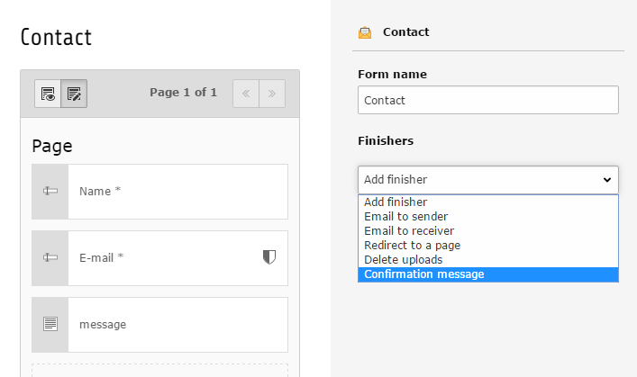
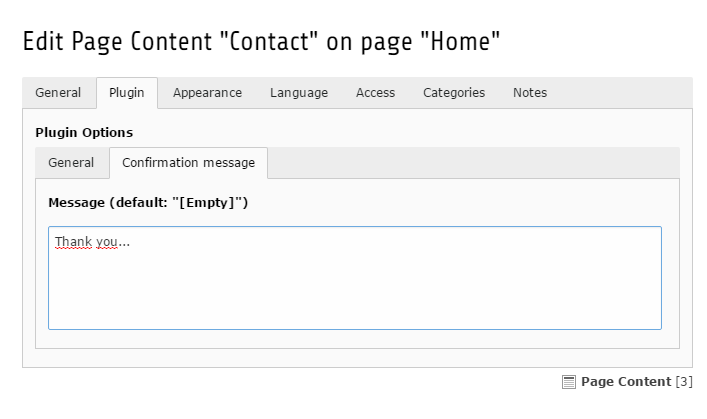

# README

This extension enable editor's to add a the core confirmation finisher for forms.

The core confirmation finsiher shows a message after submitting the form on the same page.

This extension shipps with a locallang file for easier translation of the default message.

*You can define a default message for a form.*

*The message can be overriden on each mail-form content element.*

## Installation

Simply install it over the extension manager or with composer.

## Integration

No TypoScript needs to be included!

## Contributing

Bug reports and pull request are welcome through [GitHub](https://github.com/r3h6/TYPO3.EXT.form_confirmation_finisher/).
